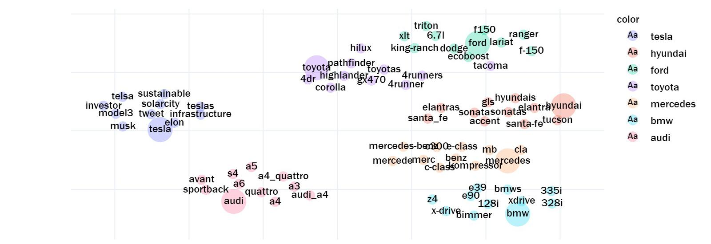
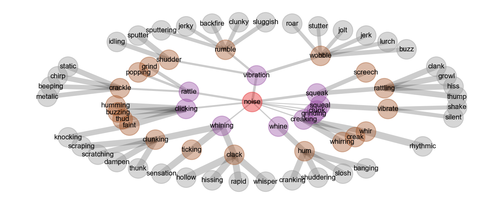
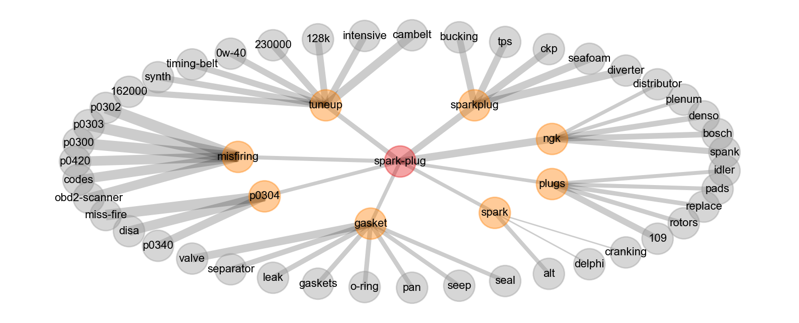

# Chapter 10: Exploring Semantic Relationships with Word Embeddings

## [Blueprints for Text Analysis Using Python](https://github.com/blueprints-for-text-analytics-python/blueprints-text)

  [[Jupyter Notebook](Embeddings.ipynb)]
  [[nbviewer](https://nbviewer.ipython.org/github/blueprints-for-text-analytics-python/blueprints-text/blob/master/ch10/Embeddings.ipynb)]
  [[colab](https://colab.research.google.com/github/blueprints-for-text-analytics-python/blueprints-text/blob/master/ch10/Embeddings.ipynb)]

## Figures

Figure 10-3. 2d-UMAP projections of all word embeddings

Figure 10-4. 2d-UMAP projections of selected keywords

Figure 10-5. 3d-UMAP projections of selected keywords

Figure 10-7. Similarity tree of words most similar to “noise” their most similar words

Figure 10.8. Similarity tree of words most similar to “spark-plug” their most similar words

