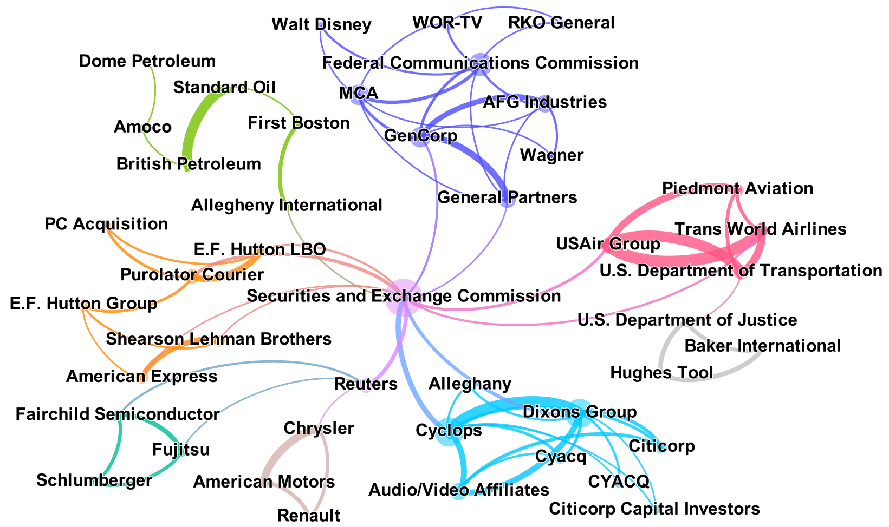
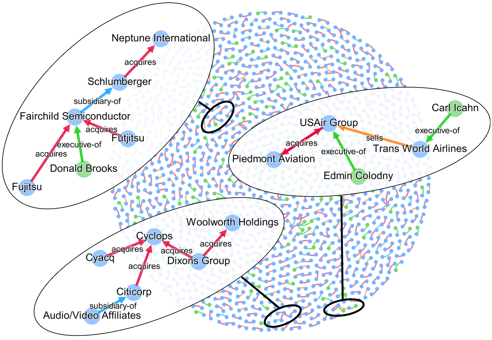

# Chapter 12: Building a Knowledge Graph

## [Blueprints for Text Analysis Using Python](https://github.com/blueprints-for-text-analytics-python/blueprints-text)

View Jupyter notebook on 
[[Github](Knowledge_Graph.ipynb)] or
[[nbviewer](https://nbviewer.ipython.org/github/blueprints-for-text-analytics-python/blueprints-text/blob/master/ch12/Knowledge_Graph.ipynb)] or run it on
[[Colab](https://colab.research.google.com/github/blueprints-for-text-analytics-python/blueprints-text/blob/master/ch12/Knowledge_Graph.ipynb)].  

## Figures

Figure 12-5. Largest connected component of the cooccurrence graph generated from the
Reuters corpus

Figure 12-6. Figure 12-6. The knowledge graph extracted from the Reuters corpus with three selected
subgraphs (visualized with the help of Gephi)

